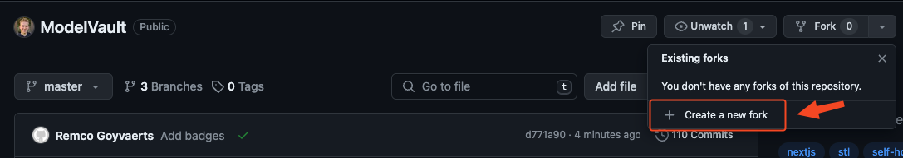

# Contributing

When contributing to this repository, please first discuss the change you wish to make via issue, email, or any other method with the owners of this repository before making a change.
Please note we have a [code of conduct](CODE_OF_CONDUCT.md), please follow it in all your interactions with the project.

To contribute to this project, please follow the [fork and PR workflow](https://docs.github.com/en/get-started/exploring-projects-on-github/contributing-to-a-project). Don't push directly to this repo unless you are a maintainer.

## Development environment setup

> **[?]**
> Proceed to describe how to setup local development environment.
> e.g:

To set up a development environment, please follow these steps:

1. Create a fork of the repo

   

2. Install requirements

   ```bash
   cd backend
   pip install -r requirements-dev.txt
   pip install -r requirements.txt
   cd ../frontend
   npm ci
   ```

## Issues and feature requests

You've found a bug in the source code, a mistake in the documentation or maybe you'd like a new feature? You can help us by [submitting an issue on GitHub](https://github.com/RemcoGoy/modelvault2/issues). Before you create an issue, make sure to search the issue archive -- your issue may have already been addressed!

Please try to create bug reports that are:

- _Reproducible._ Include steps to reproduce the problem.
- _Specific._ Include as much detail as possible: which version, what environment, etc.
- _Unique._ Do not duplicate existing opened issues.
- _Scoped to a Single Bug._ One bug per report.

**Even better: Submit a pull request with a fix or new feature!**

### How to submit a Pull Request

1. Search our repository for open or closed
   [Pull Requests](https://github.com/RemcoGoy/modelvault2/pulls)
   that relate to your submission. You don't want to duplicate effort.
2. Fork the project
3. Create your feature branch (`git checkout -b feat/amazing_feature`)
4. Commit your changes (`git commit -m 'feat: add amazing_feature'`) ModelVault uses [conventional commits](https://www.conventionalcommits.org), so please follow the specification in your commit messages.
5. Push to the branch (`git push origin feat/amazing_feature`)
6. [Open a Pull Request](https://github.com/RemcoGoy/modelvault2/compare?expand=1)
